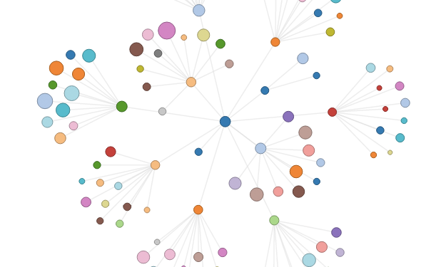

# Force-directed Graph Information Visualization

## Local Development

Browsers enforce strict security permissions to prevent you from reading files out of the local file system.

To develop locally, you must run a local web server rather than using `file://…`.

Node's [http-server](https://www.npmjs.com/package/http-server) is recommended.

### Install

`npm install -g http-server`

### Run

`http-server &` 

This will start the server on [http://localhost:8080](http://localhost:8080/) from the current working directory.

## Tasks

1. Clicking on a node of the graph makes the nodes `hidden`; [example](http://bl.ocks.org/mbostock/1093130)

2. Make the nodes of the graph images instead of circles; [example](http://bl.ocks.org/eesur/be2abfb3155a38be4de4)
